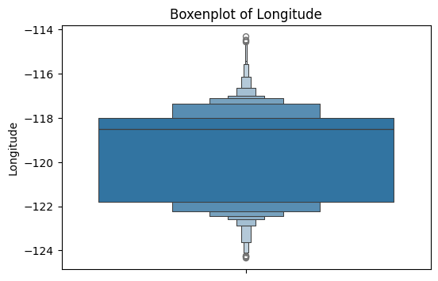

# **California Housing Price Prediction**
**Author:** Dan Miller 
**Date:** October 30th, 2025  
**Objective:** Predict the median house price in California using available housing features

## **Introduction**

This project uses the California housing dataset to predict house prices based on features such as median income, average number of rooms, and house age. We'll clean the data, train a linear regression model, and explore ways to improve performance. The dataset contains exclusively numerical data that relates to both housing and those that reside there. We will be using two variables to predict one. Visualizations will be created to show any possible relationships between the variables. After the model has been created and fit to the data, we will use R^2, MAE, and RMSE to report its effectiveness.

## **Imports**

```python
# Import pandas for data manipulation and analysis (we might want to do more with it)
# Import matplotlib for creating static visualizations
import matplotlib.pyplot as plt
import pandas as pd

# Import seaborn for statistical data visualization (built on matplotlib)
import seaborn as sns

# Import the California housing dataset from sklearn
from sklearn.datasets import fetch_california_housing

# Import LinearRegression for building a linear regression model
from sklearn.linear_model import LinearRegression

# Import performance metrics for model evaluation
from sklearn.metrics import mean_absolute_error, mean_squared_error, r2_score

# Import train_test_split for splitting data into training and test sets
from sklearn.model_selection import train_test_split
```

## **Section 1. Load and Explore the Data**

Load the data directly from scikit-learn

```python
# Load the data
data = fetch_california_housing(as_frame=True)
data_frame = data.frame  # type: ignore
```

Display the first few rows of the dataset

```python
data_frame.head(10)
```

<div>
<style scoped>
    .dataframe tbody tr th:only-of-type {
        vertical-align: middle;
    }

    .dataframe tbody tr th {
        vertical-align: top;
    }

    .dataframe thead th {
        text-align: right;
    }
</style>
<table border="1" class="dataframe">
  <thead>
    <tr style="text-align: right;">
      <th></th>
      <th>MedInc</th>
      <th>HouseAge</th>
      <th>AveRooms</th>
      <th>AveBedrms</th>
      <th>Population</th>
      <th>AveOccup</th>
      <th>Latitude</th>
      <th>Longitude</th>
      <th>MedHouseVal</th>
    </tr>
  </thead>
  <tbody>
    <tr>
      <th>0</th>
      <td>8.3252</td>
      <td>41.0</td>
      <td>6.984127</td>
      <td>1.023810</td>
      <td>322.0</td>
      <td>2.555556</td>
      <td>37.88</td>
      <td>-122.23</td>
      <td>4.526</td>
    </tr>
    <tr>
      <th>1</th>
      <td>8.3014</td>
      <td>21.0</td>
      <td>6.238137</td>
      <td>0.971880</td>
      <td>2401.0</td>
      <td>2.109842</td>
      <td>37.86</td>
      <td>-122.22</td>
      <td>3.585</td>
    </tr>
    <tr>
      <th>2</th>
      <td>7.2574</td>
      <td>52.0</td>
      <td>8.288136</td>
      <td>1.073446</td>
      <td>496.0</td>
      <td>2.802260</td>
      <td>37.85</td>
      <td>-122.24</td>
      <td>3.521</td>
    </tr>
    <tr>
      <th>3</th>
      <td>5.6431</td>
      <td>52.0</td>
      <td>5.817352</td>
      <td>1.073059</td>
      <td>558.0</td>
      <td>2.547945</td>
      <td>37.85</td>
      <td>-122.25</td>
      <td>3.413</td>
    </tr>
    <tr>
      <th>4</th>
      <td>3.8462</td>
      <td>52.0</td>
      <td>6.281853</td>
      <td>1.081081</td>
      <td>565.0</td>
      <td>2.181467</td>
      <td>37.85</td>
      <td>-122.25</td>
      <td>3.422</td>
    </tr>
    <tr>
      <th>5</th>
      <td>4.0368</td>
      <td>52.0</td>
      <td>4.761658</td>
      <td>1.103627</td>
      <td>413.0</td>
      <td>2.139896</td>
      <td>37.85</td>
      <td>-122.25</td>
      <td>2.697</td>
    </tr>
    <tr>
      <th>6</th>
      <td>3.6591</td>
      <td>52.0</td>
      <td>4.931907</td>
      <td>0.951362</td>
      <td>1094.0</td>
      <td>2.128405</td>
      <td>37.84</td>
      <td>-122.25</td>
      <td>2.992</td>
    </tr>
    <tr>
      <th>7</th>
      <td>3.1200</td>
      <td>52.0</td>
      <td>4.797527</td>
      <td>1.061824</td>
      <td>1157.0</td>
      <td>1.788253</td>
      <td>37.84</td>
      <td>-122.25</td>
      <td>2.414</td>
    </tr>
    <tr>
      <th>8</th>
      <td>2.0804</td>
      <td>42.0</td>
      <td>4.294118</td>
      <td>1.117647</td>
      <td>1206.0</td>
      <td>2.026891</td>
      <td>37.84</td>
      <td>-122.26</td>
      <td>2.267</td>
    </tr>
    <tr>
      <th>9</th>
      <td>3.6912</td>
      <td>52.0</td>
      <td>4.970588</td>
      <td>0.990196</td>
      <td>1551.0</td>
      <td>2.172269</td>
      <td>37.84</td>
      <td>-122.25</td>
      <td>2.611</td>
    </tr>
  </tbody>
</table>
</div>

### **Check data for missing values and show data types**

```python
print(data_frame.isnull().sum())
```


    MedInc         0
    HouseAge       0
    AveRooms       0
    AveBedrms      0
    Population     0
    AveOccup       0
    Latitude       0
    Longitude      0
    MedHouseVal    0
    dtype: int64

```python
data_frame.info()
```

    <class 'pandas.core.frame.DataFrame'>
    RangeIndex: 20640 entries, 0 to 20639
    Data columns (total 9 columns):
     #   Column       Non-Null Count  Dtype  
    ---  ------       --------------  -----  
     0   MedInc       20640 non-null  float64
     1   HouseAge     20640 non-null  float64
     2   AveRooms     20640 non-null  float64
     3   AveBedrms    20640 non-null  float64
     4   Population   20640 non-null  float64
     5   AveOccup     20640 non-null  float64
     6   Latitude     20640 non-null  float64
     7   Longitude    20640 non-null  float64
     8   MedHouseVal  20640 non-null  float64
    dtypes: float64(9)
    memory usage: 1.4 MB


## **Section 2. Visualize Feature Distributions**

Generate histograms for all numerical columns

```python
data_frame.hist(bins=30, figsize=(12, 8))
plt.show()
```


Generate one Boxenplot for each column

```python
for column in data_frame.columns:
    plt.figure(figsize=(6,4))
    sns.boxenplot(data=data_frame[column])
    plt.title(f"Boxenplot of {column}")
    plt.show()
```





Generate all scatter plots

```python
sns.pairplot(data_frame)
plt.show()
```


## **Section 3. Feature Selection and Justification**

Select the input features and target and define X and y

```python
# Create a list of contributing features and the target variable
features: list = ["MedInc","AveRooms"]
target: str = "MedHouseVal"

# Define input and output DataFrames

df_X = data_frame[features]  # noqa: N816
df_y = data_frame[target]
```

## **Section 4. Train a Linear Regression Model**

### **Split the data by calling train_test_split()**

```python
# Split the data into training and testing sets
X_train, X_test, y_train, y_test = train_test_split(df_X, df_y, test_size=0.2, random_state=42)
```

### **Create and train the Linear Regression Model**

```python
# Create a linear regression model
model = LinearRegression()

# Train the model
model.fit(X_train, y_train)
```

Lastly, make predictions for the test set

```python
# Make predictions for the test set
y_pred = model.predict(X_test)
```

### **Create reports of R^2, MAE, and RMSE**

Coefficient of Determination (R^2) - This tells you how well the model explains the variation in the target variable. A value close to 1 means the model fits the data well; a value close to 0 means the model doesn’t explain the variation well.
```python
# Evaluate the model using R^2
r2 = r2_score(y_test, y_pred)
print(f"R^2 Score: {r2:.2f}")
```
**R^2 Score: 0.46**

Mean Absolute Error (MAE) - This is the average of the absolute differences between the predicted values and the actual values. A smaller value means the model’s predictions are closer to the actual values.
```python
# Evaluate the model using Mean Absolute Error
mae = mean_absolute_error(y_test, y_pred)
print(f"Mean Absolute Error: {mae:.2f}")
```
**Mean Absolute Error: 0.62**

Root Mean Squared Error (RMSE) - This is the square root of the average of the squared differences between the predicted values and the actual values. It gives a sense of how far the predictions are from the actual values, with larger errors having more impact.
```python
# Evaluate the model using Root Mean Squared Error
rmse = mean_squared_error(y_test, y_pred)
print(f"Root Mean Squared Error: {rmse:.2f}")
```
**Root Mean Squared Error: 0.70**