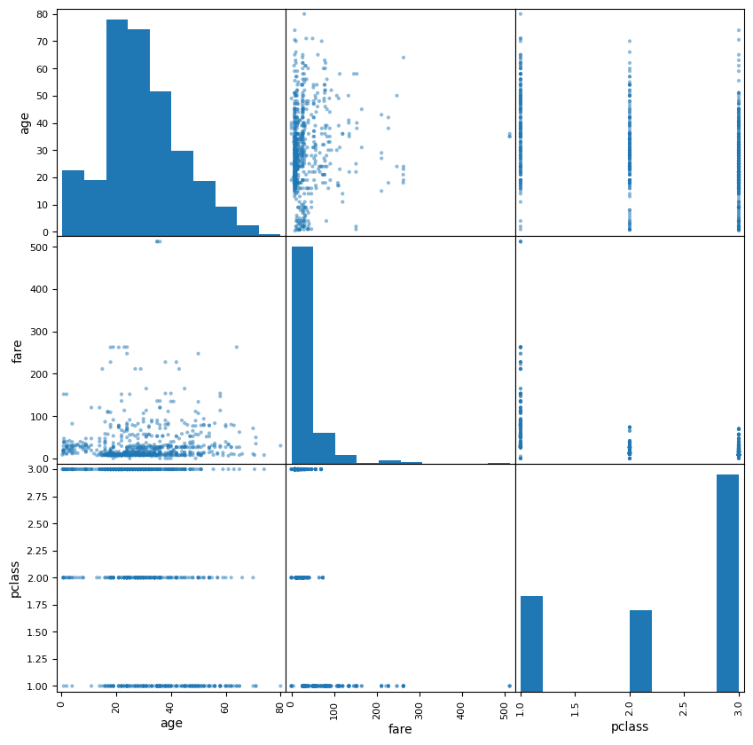
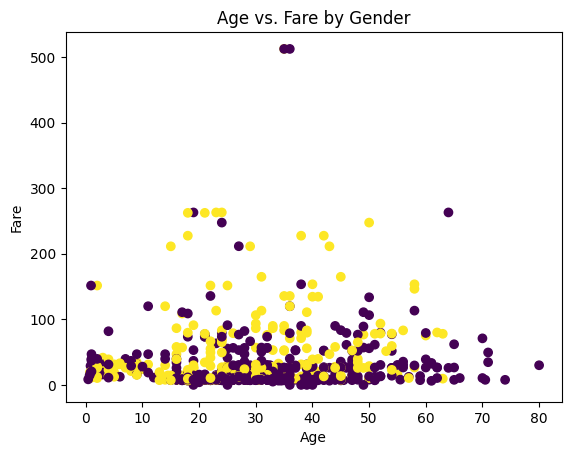
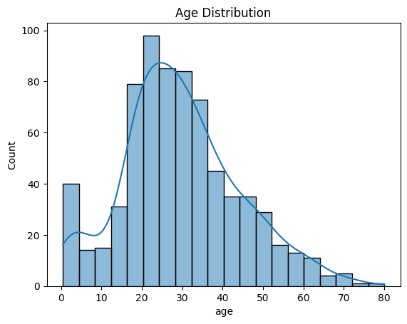
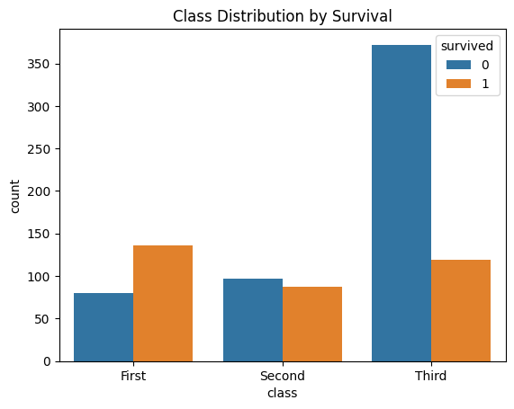

# **Titanic Data Features**
**Author:** Dan Miller 
**Date:** October 30th, 2025  
**Objective:** Explore the Titanic dataset to determine what factors impacted survival

## **Introduction**

This project explores the Titanic dataset available to us from the seaborn library. We will explore its features and determine if it needs to be cleaned or transformed. Once prepping the data is complete, we will select the features to be used as predictors and our target. In this notebook, 5 features will be used as predictors to predict the target variable survived. Lastly, we create training and testing sets, then examine those in terms of size and distribution.

## **Section 1. Import and Inspect the Data**


```python
# Imports
import matplotlib.pyplot as plt

import pandas as pd
from pandas.plotting import scatter_matrix

import seaborn as sns

from sklearn.model_selection import StratifiedShuffleSplit, train_test_split

```


```python
# Load the data
titanic = sns.load_dataset('titanic')
```

Display the first few rows of the dataset


```python
print(titanic.head(5))
```

       survived  pclass  sex   age  sibsp  parch     fare  embarked  class    who  \
    0         0       3    0  22.0      1      0   7.2500       2.0  Third    man   
    1         1       1    1  38.0      1      0  71.2833       0.0  First  woman   
    2         1       3    1  26.0      0      0   7.9250       2.0  Third  woman   
    3         1       1    1  35.0      1      0  53.1000       2.0  First  woman   
    4         0       3    0  35.0      0      0   8.0500       2.0  Third    man   
    
       adult_male deck  embark_town alive  alone  family_size  
    0        True  NaN  Southampton    no  False            2  
    1       False    C    Cherbourg   yes  False            2  
    2       False  NaN  Southampton   yes   True            1  
    3       False    C  Southampton   yes  False            2  
    4        True  NaN  Southampton    no   True            1  


Check for missing values and display summary statistics

```python
# Display missing values
print(titanic.isnull().sum())
```

    survived         0
    pclass           0
    sex              0
    age            177
    sibsp            0
    parch            0
    fare             0
    embarked         2
    class            0
    who              0
    adult_male       0
    deck           688
    embark_town      2
    alive            0
    alone            0
    dtype: int64

```python
# Display summary statistics
print(titanic.describe())
```
             survived      pclass         age       sibsp       parch        fare
    count  891.000000  891.000000  714.000000  891.000000  891.000000  891.000000
    mean     0.383838    2.308642   29.699118    0.523008    0.381594   32.204208
    std      0.486592    0.836071   14.526497    1.102743    0.806057   49.693429
    min      0.000000    1.000000    0.420000    0.000000    0.000000    0.000000
    25%      0.000000    2.000000   20.125000    0.000000    0.000000    7.910400
    50%      0.000000    3.000000   28.000000    0.000000    0.000000   14.454200
    75%      1.000000    3.000000   38.000000    1.000000    0.000000   31.000000
    max      1.000000    3.000000   80.000000    8.000000    6.000000  512.329200

Check for correlations using a correlation matrix

```python
print(titanic.corr(numeric_only=True))
```

            survived    pclass       age     sibsp     parch      fare  \
    survived    1.000000 -0.338481 -0.077221 -0.035322  0.081629  0.257307   
    pclass     -0.338481  1.000000 -0.369226  0.083081  0.018443 -0.549500   
    age        -0.077221 -0.369226  1.000000 -0.308247 -0.189119  0.096067   
    sibsp      -0.035322  0.083081 -0.308247  1.000000  0.414838  0.159651   
    parch       0.081629  0.018443 -0.189119  0.414838  1.000000  0.216225   
    fare        0.257307 -0.549500  0.096067  0.159651  0.216225  1.000000   
    adult_male -0.557080  0.094035  0.280328 -0.253586 -0.349943 -0.182024   
    alone      -0.203367  0.135207  0.198270 -0.584471 -0.583398 -0.271832   
    
                adult_male     alone  
    survived     -0.557080 -0.203367  
    pclass        0.094035  0.135207  
    age           0.280328  0.198270  
    sibsp        -0.253586 -0.584471  
    parch        -0.349943 -0.583398  
    fare         -0.182024 -0.271832  
    adult_male    1.000000  0.404744  
    alone         0.404744  1.000000  

## **Section 2. Data Exploration and Preparation**

Create a scatter matrix for age, fare, and pclass

```python
attributes = ["age", "fare", "pclass"]
scatter_matrix(titanic[attributes], figsize=(10, 10))
```



Create a scatter plot of age vs. fare

```python
plt.scatter(titanic["age"], titanic["fare"], c=titanic["sex"].apply(lambda x: 0 if x == "male" else 1))
plt.xlabel("Age")
plt.ylabel("Fare")
plt.title("Age vs. Fare by Gender")
plt.show()
```



Create a histogram of age

```python
sns.histplot(titanic["age"],kde=True) # type: ignore
plt.title("Age Distribution")
plt.show()
```



Create a count plot for class and survival

```python
sns.countplot(x="class", hue="survived", data=titanic)
plt.title("Class Distribution by Survival")
plt.show()
```



Handle the missing values by filling them with median or mode 

```python
# Impute missing values for age with median
titanic["age"] = titanic["age"].fillna(titanic["age"].median())

# Fill missing values for embark_town with mode
titanic["embark_town"] = titanic["embark_town"].fillna(titanic["embark_town"].mode()[0])
```

Create new features and convert categorical data to numeric

```python
# Create a new feature 'family_size'
titanic["family_size"] = titanic["sibsp"] + titanic["parch"] + 1

# Convert categorical data to numeric
titanic["sex"] = titanic["sex"].map({"male": 0, "female": 1})
titanic["embarked"] = titanic["embarked"].map({"C": 0, "Q": 1, "S": 2})

# Create a binary feature for 'alone'
titanic["alone"] = titanic["alone"].astype(int)
```

## **Section 3. Feature Selection and Justification**

Select the input features and the target and define X and y

```python
# Create feature inputs X and target y
X = titanic[["age", "fare", "pclass", "sex", "family_size"]]
y = titanic["survived"]
```

## **Section 4. Splitting**

Split the data into training and testing sets using the basic split and the stratified split

```python
# Create training and testing sets using train_test_split
X_train, X_test, y_train, y_test = train_test_split(X, y, test_size=0.2, random_state=123)
```

```python
# Create stratified train/test split
splitter = StratifiedShuffleSplit(n_splits=1, test_size=0.2, random_state=123)

for train_indices, test_indices in splitter.split(X, y):
    X_train_strat = X.iloc[train_indices]
    X_test_strat = X.iloc[test_indices]
    y_train_strat = y.iloc[train_indices]
    y_test_strat = y.iloc[test_indices]
```

Compare the results of the splits

```python
# Compare Basic splits and Stratified splits

print("Original Class Distribution:\n", X["pclass"].value_counts(normalize=True))

print("\nBasic Split Train Set Class Distribution:\n", X_train["pclass"].value_counts(normalize=True))
print("Basic Split Test Set Class Distribution:\n", X_test["pclass"].value_counts(normalize=True))

print("\nStratified Split Train Set Class Distribution:\n", X_train_strat["pclass"].value_counts(normalize=True))
print("Stratified Split Test Set Class Distribution:\n", X_test_strat["pclass"].value_counts(normalize=True))
```

    Original Class Distribution:
     pclass
    3    0.551066
    1    0.242424
    2    0.206510
    Name: proportion, dtype: float64

    Basic Split Train Set Class Distribution:
     pclass
    3    0.557584
    1    0.233146
    2    0.209270
    Name: proportion, dtype: float64

    Basic Split Test Set Class Distribution:
     pclass
    3    0.525140
    1    0.279330
    2    0.195531
    Name: proportion, dtype: float64

    Stratified Split Train Set Class Distribution:
     pclass
    3    0.561798
    1    0.227528
    2    0.210674
    Name: proportion, dtype: float64

    Stratified Split Test Set Class Distribution:
     pclass
    3    0.508380
    1    0.301676
    2    0.189944
    Name: proportion, dtype: float64

By comparing the two types of splits we can see that they have very similar distributions, but for this case the basic split gave slightly closer results to the original.