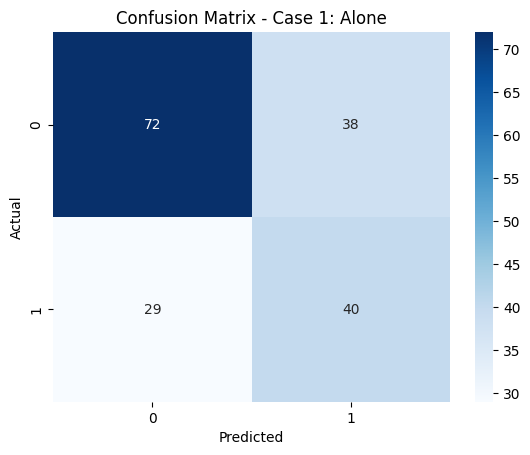
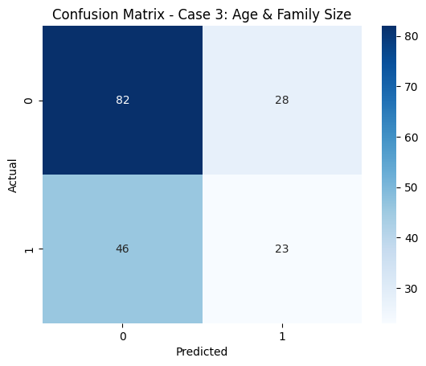
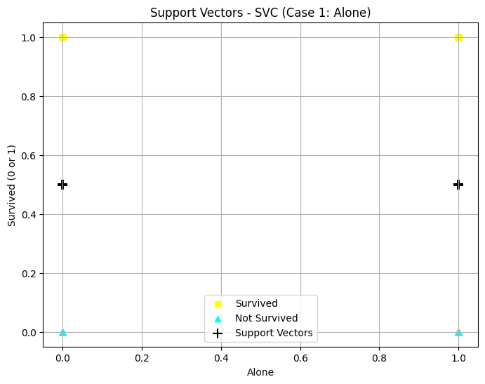
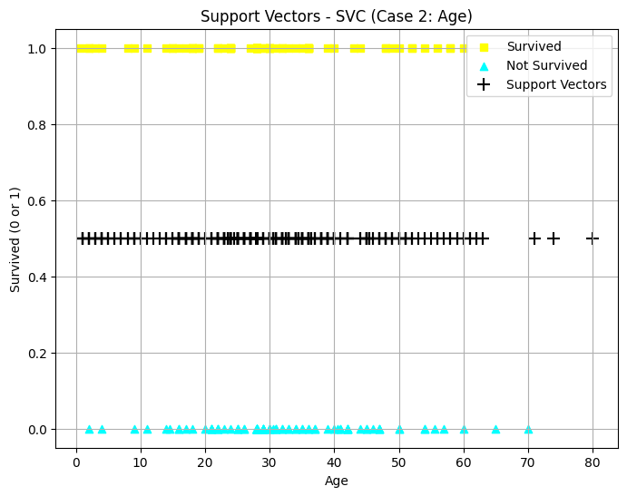
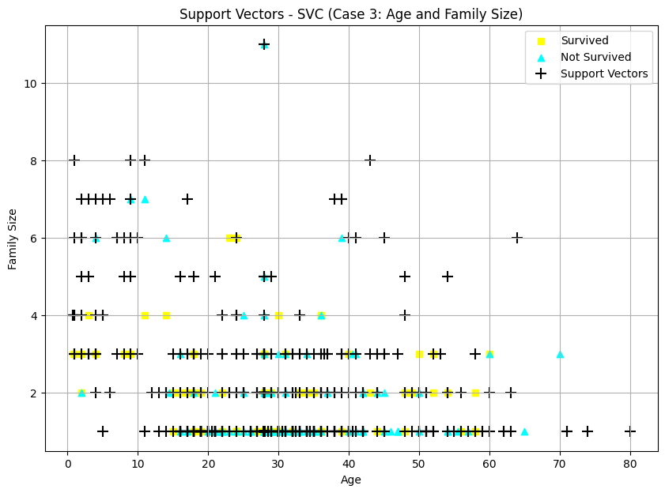
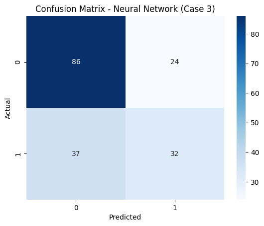
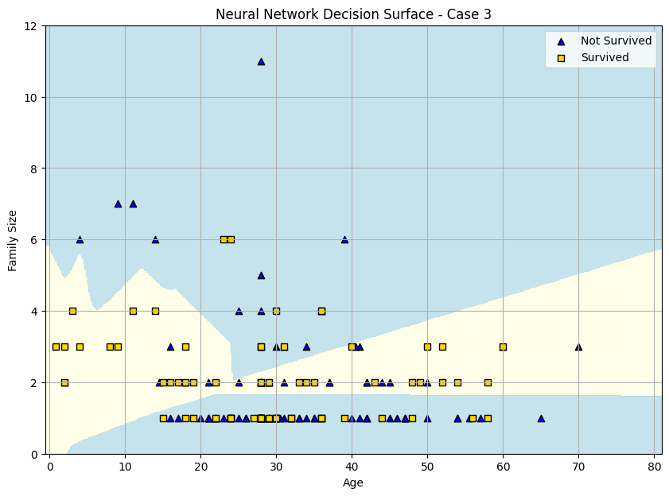

# **Building a Classifier**
**Author:** Dan Miller 
**Date:** November 5th, 2025  
**Objective:** Build and evaluate three classifiers using the Titanic dataset, then compare their performance across different feature sets in terms of predicting survival

## **Introduction**

This project explores the difference in performance between three classifiers: Decision Tree, Support Vector Machine, and Neural Network. These classifiers will be made on the Titanic dataset to predict the feature 'survived'. First, the data will be explored and there will be feature engineering done. After that, each classifier will be made individually on three separate feature sets. After all three classifiers are made and compared, there will be a summary at the end to discuss the findings.

## **Section 1. Import and Inspect the Data**


```python
# Imports
from matplotlib.colors import ListedColormap
import matplotlib.pyplot as plt
import numpy as np
import pandas as pd
import seaborn as sns
from sklearn.metrics import classification_report, confusion_matrix
from sklearn.model_selection import StratifiedShuffleSplit
from sklearn.neural_network import MLPClassifier
from sklearn.svm import SVC
from sklearn.tree import DecisionTreeClassifier, plot_tree

```


```python
# Load the data
titanic = sns.load_dataset('titanic')
```

Display the first few rows of the dataset


```python
print(titanic.head(5))
```

       survived  pclass  sex   age  sibsp  parch     fare  embarked  class    who  \
    0         0       3    0  22.0      1      0   7.2500       2.0  Third    man   
    1         1       1    1  38.0      1      0  71.2833       0.0  First  woman   
    2         1       3    1  26.0      0      0   7.9250       2.0  Third  woman   
    3         1       1    1  35.0      1      0  53.1000       2.0  First  woman   
    4         0       3    0  35.0      0      0   8.0500       2.0  Third    man   
    
       adult_male deck  embark_town alive  alone  family_size  
    0        True  NaN  Southampton    no  False            2  
    1       False    C    Cherbourg   yes  False            2  
    2       False  NaN  Southampton   yes   True            1  
    3       False    C  Southampton   yes  False            2  
    4        True  NaN  Southampton    no   True            1  

## **Section 2. Data Exploration and Preparation**

Handle the missing values by filling them with median or mode

```python
# Impute missing values for age with median
titanic["age"] = titanic["age"].fillna(titanic["age"].median())

# Fill missing values for embark_town with mode
titanic["embark_town"] = titanic["embark_town"].fillna(titanic["embark_town"].mode()[0])
```

Create new features and convert categorical data to numeric

```python
# Create a new feature 'family_size'
titanic["family_size"] = titanic["sibsp"] + titanic["parch"] + 1

# Convert categorical data to numeric
titanic["sex"] = titanic["sex"].map({"male": 0, "female": 1})
titanic["embarked"] = titanic["embarked"].map({"C": 0, "Q": 1, "S": 2})

# Create a binary feature for 'alone'
titanic["alone"] = titanic["alone"].astype(int)
```

## **Section 3. Feature Selection and Justification**

There will be three different input cases, so we create three sets of X and y

```python
# Case 1: Feature = alone

X1 = titanic[["alone"]]

y1 = titanic["survived"]
```

```python
# Case 2: Feature = age (drop if na or not available)

X2 = titanic[["age"]].dropna()

y2 = titanic.loc[X2.index, "survived"]
```

```python
# Case 3: Features = age & family_size (drop if na or not available)

X3 = titanic[["age", "family_size"]].dropna()

y3 = titanic.loc[X3.index, "survived"]
```

## **Section 4. Train a Classification Model (Decision Tree)**

First split the data, there will be a split for each case

```python
splitter1 = StratifiedShuffleSplit(n_splits=1, test_size=0.2, random_state=123)
for train_idx1, test_idx1 in splitter1.split(X1, y1):
    X1_train, X1_test = X1.iloc[train_idx1], X1.iloc[test_idx1]
    y1_train, y1_test = y1.iloc[train_idx1], y1.iloc[test_idx1]
```

```python
splitter2 = StratifiedShuffleSplit(n_splits=1, test_size=0.2, random_state=123)
for train_idx2, test_idx2 in splitter2.split(X2, y2):
    X2_train, X2_test = X2.iloc[train_idx2], X2.iloc[test_idx2]
    y2_train, y2_test = y2.iloc[train_idx2], y2.iloc[test_idx2]
```

```python
splitter3 = StratifiedShuffleSplit(n_splits=1, test_size=0.2, random_state=123)
for train_idx3, test_idx3 in splitter3.split(X3, y3):
    X3_train, X3_test = X3.iloc[train_idx3], X3.iloc[test_idx3]
    y3_train, y3_test = y3.iloc[train_idx3], y3.iloc[test_idx3]
```

Now create the Decision Trees and train them

```python
# Case 1: Decision Tree using alone

tree_model1 = DecisionTreeClassifier()
tree_model1.fit(X1_train, y1_train)
```

```python
# Case 2: Decision Tree using age

tree_model2 = DecisionTreeClassifier()
tree_model2.fit(X2_train, y2_train)
```

```python
# Case 3: Decision Tree using age & family_size

tree_model3 = DecisionTreeClassifier()
tree_model3.fit(X3_train, y3_train)
```

For each case, predictions are made and the classification report is shown

```python
# Case 1
# Predict on training data
y1_pred = tree_model1.predict(X1_train)
print("Results for Decision Tree on training data (Case 1 - alone):")
print(classification_report(y1_train, y1_pred))

# Predict on test data
y1_test_pred = tree_model1.predict(X1_test)
print("Results for Decision Tree on test data (Case 1 - alone):")
print(classification_report(y1_test, y1_test_pred))
```

    Results for Decision Tree on training data (Case 1 - alone):
                   precision    recall  f1-score   support

               0       0.69      0.69      0.69       439
               1       0.50      0.51      0.51       273

        accuracy                           0.62       712
       macro avg       0.60      0.60      0.60       712
    weighted avg       0.62      0.62      0.62       712

    Results for Decision Tree on test data (Case 1 - alone):
                   precision    recall  f1-score   support

               0       0.71      0.65      0.68       110
               1       0.51      0.58      0.54        69

        accuracy                           0.63       179
       macro avg       0.61      0.62      0.61       179
    weighted avg       0.64      0.63      0.63       179

---

```python
# Case 2
# Predict on training data
y2_pred = tree_model2.predict(X2_train)
print("Results for Decision Tree on training data (Case 2 - age):")
print(classification_report(y2_train, y2_pred))

# Predict on test data
y2_test_pred = tree_model2.predict(X2_test)
print("Results for Decision Tree on test data (Case 2 - age):")
print(classification_report(y2_test, y2_test_pred))
```

    Results for Decision Tree on training data (Case 2 - age):
                   precision    recall  f1-score   support

               0       0.68      0.92      0.78       439
               1       0.69      0.29      0.41       273

        accuracy                           0.68       712
       macro avg       0.68      0.61      0.60       712
    weighted avg       0.68      0.68      0.64       712

    Results for Decision Tree on test data (Case 2 - age):
                   precision    recall  f1-score   support

               0       0.63      0.89      0.74       110
               1       0.50      0.17      0.26        69

        accuracy                           0.61       179
       macro avg       0.57      0.53      0.50       179
    weighted avg       0.58      0.61      0.55       179

---

```python
# Case 3
# Predict on training data
y3_pred = tree_model3.predict(X3_train)
print("Results for Decision Tree on training data (Case 3 - age & family_size):")
print(classification_report(y3_train, y3_pred))

# Predict on test data
y3_test_pred = tree_model3.predict(X3_test)
print("Results for Decision Tree on test data (Case 3 - age & family_size):")
print(classification_report(y3_test, y3_test_pred))
```

    Results for Decision Tree on training data (Case 3 - age & family_size):
                   precision    recall  f1-score   support

               0       0.77      0.90      0.83       439
               1       0.77      0.56      0.65       273

        accuracy                           0.77       712
       macro avg       0.77      0.73      0.74       712
    weighted avg       0.77      0.77      0.76       712

    Results for Decision Tree on test data (Case 3 - age & family_size):
                   precision    recall  f1-score   support

               0       0.64      0.75      0.69       110
               1       0.45      0.33      0.38        69

        accuracy                           0.59       179
       macro avg       0.55      0.54      0.54       179
    weighted avg       0.57      0.59      0.57       179

---

We create a confusion matrix for each case

```python
# Create a confusion matrix for test predictions of Case 1
cm1 = confusion_matrix(y1_test, y1_test_pred)

# Plot confusion matrix as heatmap
sns.heatmap(cm1, annot=True, cmap="Blues")
plt.title("Confusion Matrix - Case 1: Alone")
plt.xlabel("Predicted")
plt.ylabel("Actual")
plt.show()
```



```python
# Create a confusion matrix for test predictions of Case 2
cm2 = confusion_matrix(y2_test, y2_test_pred)

# Plot confusion matrix as heatmap
sns.heatmap(cm2, annot=True, cmap="Blues")
plt.title("Confusion Matrix - Case 2: Age")
plt.xlabel("Predicted")
plt.ylabel("Actual")
plt.show()
```


```python
# Create a confusion matrix for test predictions of Case 3
cm3 = confusion_matrix(y3_test, y3_test_pred)

# Plot confusion matrix as heatmap
sns.heatmap(cm3, annot=True, cmap="Blues")
plt.title("Confusion Matrix - Case 3: Age & Family Size")
plt.xlabel("Predicted")
plt.ylabel("Actual")
plt.show()
```



Finally the Decision Trees are plotted

```python
# Plot Decision Tree for Case 1
fig = plt.figure(figsize=(12, 6))
plot_tree(tree_model1, feature_names=X1.columns, class_names=["Not Survived", "Survived"], filled=True) # type: ignore
plt.title("Decision Tree - Case 1: Alone")
plt.show()
```


```python
# Plot Decision Tree for Case 2
fig = plt.figure(figsize=(12, 6))
plot_tree(tree_model2, feature_names=X2.columns, class_names=["Not Survived", "Survived"], filled=True) # type: ignore
plt.title("Decision Tree - Case 2: Age")
plt.show()
```


```python
# Plot Decision Tree for Case 3
fig = plt.figure(figsize=(16, 8))
plot_tree(tree_model3, feature_names=X3.columns, class_names=["Not Survived", "Survived"], filled=True) # type: ignore
plt.title("Decision Tree - Case 3: Age & Family Size")
plt.show()
```


## **Section 5. Compare Alternative Models (SVC, NN)**

Now it's time to create the other models, starting with SVC

First create the model, then train, predict, and print a classification report for each case

```python
# Case 1: SVC using "alone"

svc_model1 = SVC()
svc_model1.fit(X1_train, y1_train)
y1_svc_pred = svc_model1.predict(X1_test)

print("Results for SVC on test data (Case 1 - alone):")
print(classification_report(y1_test, y1_svc_pred))
```

    Results for SVC on test data (Case 1 - alone):
                   precision    recall  f1-score   support

               0       0.71      0.65      0.68       110
               1       0.51      0.58      0.54        69

        accuracy                           0.63       179
       macro avg       0.61      0.62      0.61       179
    weighted avg       0.64      0.63      0.63       179

---

```python
# Case 2: SVC using "age"

svc_model2 = SVC()
svc_model2.fit(X2_train, y2_train)
y2_svc_pred = svc_model2.predict(X2_test)

print("Results for SVC on test data (Case 2 - age):")
print(classification_report(y2_test, y2_svc_pred))
```

    Results for SVC on test data (Case 2 - age):
                   precision    recall  f1-score   support

               0       0.63      0.98      0.77       110
               1       0.71      0.07      0.13        69

        accuracy                           0.63       179
       macro avg       0.67      0.53      0.45       179
    weighted avg       0.66      0.63      0.52       179

---

```python
# Case 3: SVC using "age" and "family_size"

svc_model3 = SVC()
svc_model3.fit(X3_train, y3_train)
y3_svc_pred = svc_model3.predict(X3_test)

print("Results for SVC on test data (Case 3 - age and family_size):")
print(classification_report(y3_test, y3_svc_pred))
```

    Results for SVC on test data (Case 3 - age and family_size):
                  precision    recall  f1-score   support

               0       0.63      0.98      0.77       110
               1       0.71      0.07      0.13        69

        accuracy                           0.63       179
       macro avg       0.67      0.53      0.45       179
    weighted avg       0.66      0.63      0.52       179

---

Now it's time to create the visuals of the support vectors for each case

```python
# Visualize support vectors for Case 1

# Create groups based on survival
survived_alone = X1_test.loc[y1_test == 1, "alone"]
not_survived_alone = X1_test.loc[y1_test == 0, "alone"]

# Create scatter plot for survived and not survived
plt.figure(figsize=(8,6))

plt.scatter(survived_alone, y1_test.loc[y1_test == 1], c="yellow", marker="s", label="Survived")
plt.scatter(not_survived_alone, y1_test.loc[y1_test == 0], c="cyan", marker="^", label="Not Survived")

# Overlay support vectors
# Check if the model has support_vectors_
if hasattr(svc_model1, "support_vectors_"):
    # Get the X values of the support vectors
    support_x = svc_model1.support_vectors_[:, 0]
    # Plot them using a fixed Y value
    plt.scatter(support_x, [0.5] * len(support_x), c="black", marker="+", s=100,label="Support Vectors")

# Add labels and legend
plt.xlabel("Alone")
plt.ylabel("Survived (0 or 1)")
plt.title("Support Vectors - SVC (Case 1: Alone)")
plt.legend()
plt.grid(True)
plt.show()
```



```python
# Visualize support vectors for Case 2

# Create groups based on survival
survived = X2_test.loc[y2_test == 1, "age"]
not_survived = X2_test.loc[y2_test == 0, "age"]

# Create scatter plot for survived and not survived
plt.figure(figsize=(8,6))

plt.scatter(survived, y2_test.loc[y2_test == 1], c="yellow", marker="s", label="Survived")
plt.scatter(not_survived, y2_test.loc[y2_test == 0], c="cyan", marker="^", label="Not Survived")

# Overlay support vectors
# Check if the model has support_vectors_
if hasattr(svc_model2, "support_vectors_"):
    # Get the X values of the support vectors
    support_x = svc_model2.support_vectors_[:, 0]
    # Plot them using a fixed Y value
    plt.scatter(support_x, [0.5] * len(support_x), c="black", marker="+", s=100, label="Support Vectors")

# Add labels and legend
plt.xlabel("Age")
plt.ylabel("Survived (0 or 1)")
plt.title("Support Vectors - SVC (Case 2: Age)")
plt.legend()
plt.grid(True)
plt.show()
```



```python
# Visualize support vectors for Case 3

# Create groups based on survival
survived3 = X3_test[y3_test == 1]
not_survived3 = X3_test[y3_test == 0]

# Create scatter plot
plt.figure(figsize=(10,7))

# Plot survived
plt.scatter(survived3["age"], survived3["family_size"], c="yellow", marker="s", label="Survived")

# Plot not survived
plt.scatter(not_survived3["age"], not_survived3["family_size"], c="cyan", marker="^", label="Not Survived")

# Overlay support vectors
if hasattr(svc_model3, "support_vectors_"):
    support_vectors = svc_model3.support_vectors_
    plt.scatter(support_vectors[:, 0], support_vectors[:, 1], c="black", marker="+", s=100, label="Support Vectors")

# Add labels and legend
plt.xlabel("Age")
plt.ylabel("Family Size")
plt.title("Support Vectors - SVC (Case 3: Age and Family Size)")
plt.legend()
plt.grid(True)
plt.show()
```



Lastly, the Neural Network is created, but only for Case 3
The model is created and trained, then makes predictions so the classification report can be shown

```python
# Create and Train NN for Case 3 (age & family_size)

nn_model3 = MLPClassifier(hidden_layer_sizes=(50, 25, 10), solver="lbfgs", max_iter=1000, random_state=42)

nn_model3.fit(X3_train, y3_train)

# Predict on test data (Case 3)

y3_nn_pred = nn_model3.predict(X3_test)

# Print report
print("Results for Neural Network on test data (Case 3 - age & family_size):")
print(classification_report(y3_test, y3_nn_pred))
```

    Results for Neural Network on test data (Case 3 - age & family_size):
                   precision    recall  f1-score   support

               0       0.70      0.78      0.74       110
               1       0.57      0.46      0.51        69

        accuracy                           0.66       179
       macro avg       0.64      0.62      0.63       179
    weighted avg       0.65      0.66      0.65       179

---

A confusion matrix is also created

```python
# Create confusion matrix
cm_nn3 = confusion_matrix(y3_test, y3_nn_pred)

# Plot heatmap
sns.heatmap(cm_nn3, annot=True, cmap="Blues")
plt.title("Confusion Matrix - Neural Network (Case 3)")
plt.xlabel("Predicted")
plt.ylabel("Actual")
plt.show()
```



To finish things off, a Decision Surface of the Neural Network is created and shown

```python
# Get the range of oour two features
padding = 1
x_min, x_max = X3["age"].min()-padding,X3["age"].max()+padding
y_min, y_max = X3["family_size"].min()-padding, X3["family_size"].max()+padding

# Create a meshgrid
xx, yy = np.meshgrid(np.linspace(x_min, x_max, 500), np.linspace(y_min, y_max, 500))

# Flatten the grid arrays and prepare them for prediction
Z = nn_model3.predict(np.c_[xx.ravel(), yy.ravel()])

# Reshape the predicted results
Z = Z.reshape(xx.shape)

# Plot the decision surface showing predicted survival zones
# Blue for 0, yellow for 1
plt.figure(figsize=(10, 7))
cmap_background = ListedColormap(["lightblue", "lightyellow"])
plt.contourf(xx,yy,Z, cmap=cmap_background, alpha=0.7)

# Overlay the actual test data points

# Plot the passengers who didn't survive 
plt.scatter(X3_test["age"][y3_test==0], X3_test["family_size"][y3_test==0], c="blue", marker="^", edgecolor="k", label="Not Survived")

# Plot the passengers who survived
plt.scatter(X3_test["age"][y3_test==1], X3_test["family_size"][y3_test==1], c="gold", marker="s", edgecolor="k", label="Survived")

# Add labels and legend
plt.xlabel("Age")
plt.ylabel("Family Size")
plt.title("Neural Network Decision Surface - Case 3")
plt.legend()
plt.grid(True)
plt.show()
```



## **Section 6. Final Thoughts & Insights**

A summary table of all the models' performances is made

**Summary**

| Model                | Precision | Recall | F1-Score | Accuracy |
| :------------------: | :-------- | :----- | :------- | :------- |
| Decision Tree Case 1 | 0.51      | 0.58   | 0.54     | 0.63     |
| Decision Tree Case 2 | 0.50      | 0.17   | 0.26     | 0.61     |
| Decision Tree Case 3 | 0.46      | 0.35   | 0.40     | 0.59     |
| SVC Case 1           | 0.51      | 0.58   | 0.54     | 0.63     |
| SVC Case 2           | 0.71      | 0.07   | 0.13     | 0.63     |
| SVC Case 3           | 0.71      | 0.07   | 0.13     | 0.63     |
| NN Case 3            | 0.57      | 0.46   | 0.51     | 0.66     |

It's clear from the summary table that the Neural Network was the model that performed the best. Although Decision Tree Case 1 had a higher recall and f1-score, Neural Network's higher precision and accuracy mean more to me. Cases 2 and 3 of the SVC models performed very similarly to each other. Case 1's data had a higher recall and f1-score with a lower Precision. When looking at all three Decision Trees, we get pretty different results for all three. Regurgitating what was said previously, Case 1 of the Decision Trees performed the best.

**Challenges**

The greatest challenge I had while creating this notebook was understanding the Classification Reports and Confusion Matrices simply because I don't have much experience with them. I wasn't sure which value for precison, recall, etc. I was supposed to be looking at. Originally I went with the weighted average, but went back and changed it to the row labeld '1' because I figured that all these models are about predicting survival.

**Next Steps**

To go further with this dataset, I would want to create models that take more than just one or two inputs, because of all the models we created, the highest accuracy was only 66%, which isn't bad but it definitely could be better. I would most likely use features like sex and class when creating those new models.

Furthering my exploration of classification models, I would want to try creating models on a differently structured dataset, for instance a dataset of images rather than a table. It would also be nice to try different kinds of classification models like K-Nearest Neighbors.