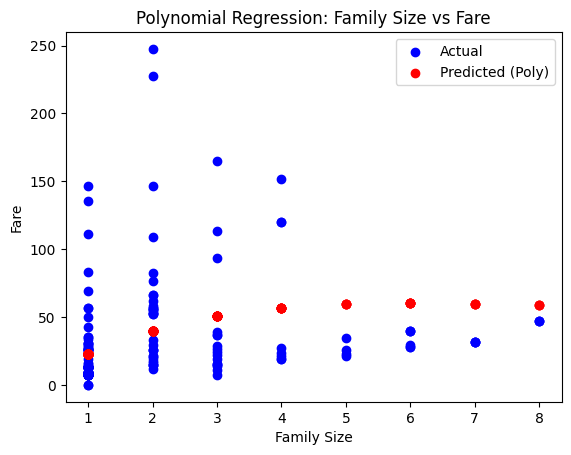
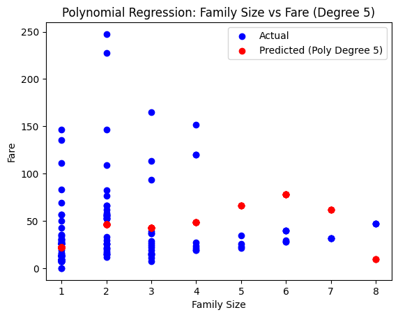

# Predicting a Continuous Target with Regression
**Author:** Dan Miller
**Date:** November 12th, 2025
**Objective:** Be able to predict a continuous numeric target, fare, using features in the Titanic dataset

## **Introduction**

This project explores the seaborn Titanic dataset. With the goal of being able to predict a continuous target with regression, linear regression as well as some alternative models will all be created and evaluated in terms of predicting fare, the price of the journey. The data will be explored and prepped before the models are created. There will be a summary at the end to discuss the findings.

## Imports

```python
import matplotlib.pyplot as plt
import numpy as np
import pandas as pd
import seaborn as sns

from sklearn.linear_model import ElasticNet, LinearRegression, Ridge
from sklearn.metrics import mean_absolute_error, mean_squared_error, r2_score
from sklearn.model_selection import train_test_split
from sklearn.preprocessing import PolynomialFeatures
```

## Section 1. Import and Inspect the Data

```python
# Load the Titanic dataset
titanic = sns.load_dataset("titanic")

# Inspect the first few rows of the dataset
titanic.head()
```

       survived  pclass  sex   age  sibsp  parch     fare  embarked  class    who  \
    0         0       3    0  22.0      1      0   7.2500       2.0  Third    man   
    1         1       1    1  38.0      1      0  71.2833       0.0  First  woman   
    2         1       3    1  26.0      0      0   7.9250       2.0  Third  woman   
    3         1       1    1  35.0      1      0  53.1000       2.0  First  woman   
    4         0       3    0  35.0      0      0   8.0500       2.0  Third    man   
    
       adult_male deck  embark_town alive  alone  family_size  
    0        True  NaN  Southampton    no  False            2  
    1       False    C    Cherbourg   yes  False            2  
    2       False  NaN  Southampton   yes   True            1  
    3       False    C  Southampton   yes  False            2  
    4        True  NaN  Southampton    no   True            1  

## Section 2. Data Exploration and Preparation

```python
# Impute missing values for age using median
titanic["age"] = titanic["age"].fillna(titanic["age"].median())

# Drop rows with missing fare
titanic = titanic.dropna(subset=["fare"])

# Create a new feature for family size
titanic["family_size"] = titanic["sibsp"] + titanic["parch"] + 1

# Fill missing values in the embarked column with the most common value
titanic["embarked"] = titanic["embarked"].fillna(titanic["embarked"].mode()[0])

# Map categorical variable embarked to numerical values
titanic["embarked"] = titanic["embarked"].map({"C": 0, "Q": 1, "S": 2})
```

## Section 3. Feature Selection & Justification

There will be four different cases, so we create four sets of X and y

```python
# Case 1 - age

X1 = titanic[["age"]]
y1 = titanic["fare"]

# Case 2 - family_size

X2 = titanic[["family_size"]]
y2 = titanic["fare"]

# Case 3 - age & family_size

X3 = titanic[["age", "family_size"]]
y3 = titanic["fare"]

# Case 4 - pclass & embarked
X4 = titanic[["pclass", "embarked"]]
y4 = titanic["fare"]
```

## Section 4. Train a Regression Model (Linear Regression)

First we split the data

```python
# Create training and testing sets for each case

X1_train, X1_test, y1_train, y1_test = train_test_split(X1, y1, test_size=0.2, random_state=123)

X2_train, X2_test, y2_train, y2_test = train_test_split(X2, y2, test_size=0.2, random_state=123)

X3_train, X3_test, y3_train, y3_test = train_test_split(X3, y3, test_size=0.2, random_state=123)

X4_train, X4_test, y4_train, y4_test = train_test_split(X4, y4, test_size=0.2, random_state=123)
```

Next, create the models, train them, and make predictions

```python
# Create Linear Regression models and train them

lr_model1 = LinearRegression().fit(X1_train, y1_train)
lr_model2 = LinearRegression().fit(X2_train, y2_train)
lr_model3 = LinearRegression().fit(X3_train, y3_train)
lr_model4 = LinearRegression().fit(X4_train, y4_train)

# Make predictions on the test sets

y_pred_train1 = lr_model1.predict(X1_train)
y_pred_test1 = lr_model1.predict(X1_test)

y_pred_train2 = lr_model2.predict(X2_train)
y_pred_test2 = lr_model2.predict(X2_test)

y_pred_train3 = lr_model3.predict(X3_train)
y_pred_test3 = lr_model3.predict(X3_test)

y_pred_train4 = lr_model4.predict(X4_train)
y_pred_test4 = lr_model4.predict(X4_test)
```

Finally, print the metrics for each model

```python
# Case 1 - age
print("Case 1: Training R2:", r2_score(y1_train, y_pred_train1))
print("Case 1: Test R2:", r2_score(y1_test, y_pred_test1))
print("Case 1: Test RMSE:", mean_squared_error(y1_test, y_pred_test1))
print("Case 1: Test MAE:", mean_absolute_error(y1_test, y_pred_test1))
print("\n")
# Case 2 - family_size
print("Case 2: Training R2:", r2_score(y2_train, y_pred_train2))
print("Case 2: Test R2:", r2_score(y2_test, y_pred_test2))
print("Case 2: Test RMSE:", mean_squared_error(y2_test, y_pred_test2))
print("Case 2: Test MAE:", mean_absolute_error(y2_test, y_pred_test2))
print("\n")
# Case 3 - age & family_size
print("Case 3: Training R2:", r2_score(y3_train, y_pred_train3))
print("Case 3: Test R2:", r2_score(y3_test, y_pred_test3))
print("Case 3: Test RMSE:", mean_squared_error(y3_test, y_pred_test3))
print("Case 3: Test MAE:", mean_absolute_error(y3_test, y_pred_test3))
print("\n")
# Case 4 - pclass & embarked
print("Case 4: Training R2:", r2_score(y4_train, y_pred_train4))
print("Case 4: Test R2:", r2_score(y4_test, y_pred_test4))
print("Case 4: Test RMSE:", mean_squared_error(y4_test, y_pred_test4))
print("Case 4: Test MAE:", mean_absolute_error(y4_test, y_pred_test4))
```

    Case 1: Training R2: 0.009950688019452314
    Case 1: Test R2: 0.0034163395508415295
    Case 1: Test RMSE: 1441.8455811188421
    Case 1: Test MAE: 25.28637293162364


    Case 2: Training R2: 0.049915792364760736
    Case 2: Test R2: 0.022231186110131973
    Case 2: Test RMSE: 1414.6244812277246
    Case 2: Test MAE: 25.02534815941641


    Case 3: Training R2: 0.07347466201590014
    Case 3: Test R2: 0.049784832763073106
    Case 3: Test RMSE: 1374.7601875944658
    Case 3: Test MAE: 24.284935030470688


    Case 4: Training R2: 0.3182447277079269
    Case 4: Test R2: 0.3295273925136103
    Case 4: Test RMSE: 970.0319247957374
    Case 4: Test MAE: 21.315443001585543

## Section 5. Compare Alternative Models

Now we'll create other regression models using Case 4

First up is a Ridge Regression model

```python
# Create ridge model, train it, and make predictions

ridge_model = Ridge(alpha=1.0).fit(X4_train, y4_train)
y_pred_ridge = ridge_model.predict(X4_test)
```

Next is an Elastic Net model

```python
# Create elastic net model, train it, and make predictions

elastic_model = ElasticNet(alpha=0.3, l1_ratio=0.5).fit(X4_train, y4_train)
y_pred_elastic = elastic_model.predict(X4_test)
```

The last one is a Polynomial Regression model

```python
# Set up the poly inputs

poly = PolynomialFeatures(degree=3)
X_train_poly = poly.fit_transform(X4_train)
X_test_poly = poly.transform(X4_test)

# Use the poly inputs in the LR model

poly_model = LinearRegression().fit(X_train_poly, y4_train)
y_pred_poly = poly_model.predict(X_test_poly)
```

Now we plot the polynomial fit for a case that only has one input (Case 2)

```python
# Plot the polynomial fit for a case with one input feature (Case 2 - family_size)
poly2 = PolynomialFeatures(degree=3)
X2_train_poly = poly2.fit_transform(X2_train)
X2_test_poly = poly2.transform(X2_test)
poly2_model = LinearRegression().fit(X2_train_poly, y2_train)
y_pred_poly2 = poly2_model.predict(X2_test_poly)

plt.scatter(X2_test, y2_test, color="blue", label="Actual")
plt.scatter(X2_test, y_pred_poly2, color="red", label="Predicted (Poly)")
plt.legend()
plt.title("Polynomial Regression: Family Size vs Fare")
plt.xlabel("Family Size")
plt.ylabel("Fare")
plt.show()
```



---

To show how the different models performed, we print their metrics

```python
# Create function to print metrics
def report(name, y_true, y_pred):  # noqa: D103
    print(f"{name}:")
    print("R2:", r2_score(y_true, y_pred))
    print("RMSE:", mean_squared_error(y_true, y_pred))
    print("MAE:", mean_absolute_error(y_true, y_pred))
    print("\n")

# Call report function for each model
report("Linear", y4_test, y_pred_test4)
report("Ridge", y4_test, y_pred_ridge)
report("ElasticNet", y4_test, y_pred_elastic)
report("Polynomial", y4_test, y_pred_poly)
```

    Linear:
    R2: 0.3295273925136103
    RMSE: 970.0319247957374
    MAE: 21.315443001585543


    Ridge:
    R2: 0.33013977889602564
    RMSE: 969.1459313418362
    MAE: 21.285901231060585


    ElasticNet:
    R2: 0.3657364688023218
    RMSE: 917.6450568234654
    MAE: 19.82747361535895


    Polynomial:
    R2: 0.38583844122610345
    RMSE: 888.5617582894122
    MAE: 18.566016175116612

Lastly, we plot another polynomial fit for the same case, but use a higher degree

```python
# Plot the polynomial fit for Case 2 but with a higher degree
poly3 = PolynomialFeatures(degree=5)
X2_train_poly3 = poly3.fit_transform(X2_train)
X2_test_poly3 = poly3.transform(X2_test)
poly3_model = LinearRegression().fit(X2_train_poly3, y2_train)
y_pred_poly3 = poly3_model.predict(X2_test_poly3)

plt.scatter(X2_test, y2_test, color="blue", label="Actual")
plt.scatter(X2_test, y_pred_poly3, color="red", label="Predicted (Poly Degree 5)")
plt.legend()
plt.title("Polynomial Regression: Family Size vs Fare (Degree 5)")
plt.xlabel("Family Size")
plt.ylabel("Fare")
plt.show()
```



## Section 6. Final Thoughts & Insights

**Table 1 - Linear Regression**

|  Case                      |  R2   |  RMSE  |  MAE  |
| :------------------------: | ----: | -----: | ----: |
| Case 1 - Age               | 0.003 | 1441   | 25.29 |
| Case 2 - Family Size       | 0.022 | 1414   | 25.03 |
| Case 3 - Age & Family Size | 0.050 | 1374   | 24.28 |
| Case 4 - Pclass & Embarked | 0.330 | 970.0  | 21.32 |

**Table 2 - Case 4 Alternate Models**

|   Model    |  R2   |  RMSE  |  MAE  |
| :--------: | ----: | -----: | ----: |
| Linear     | 0.330 | 970.0  | 21.32 |
| Ridge      | 0.330 | 969.1  | 21.29 |
| ElasticNet | 0.366 | 917.6  | 19.83 |
| Polynomial | 0.386 | 888.6  | 18.57 |

1) What features were most useful?  
   
   Case 4 performed the best, and it used the features pclass & embarked.

2) What regression model performed best?  
   
   Of all the models, the Polynomial model performed the best.

3) How did model complexity or regularization affect results?  
   
   Increasing model complexity created models that were more accurate; however, making the models too complex (adding too many degrees to the polynomial) hurt the results.  Regularization had a similar affect.  The ridge and elastic net models performed better than normal linear regression.

**Discuss Challenges**

1) Was fare hard to predict? Why?  
   
   Yes, fare was hard to predict.  This is most likely because the models were too simple.  The linear models almost all seemed to underfit, aside from Case 4.  This also brings up the fact that fare may depend on combinations of features in a nonlinear way that weren't present in this notebook.

2) Did skew or outliers impact the models?  
   
   There are a few outliers that negatively impacted model performance.  In linear regression, coefficients get pulled toward outliers, making predictions worse.  We can see in the polynomial plots of Family Size vs Fare that fare is right-skewed, which ended up causing the model to overestimate prices for large families.

