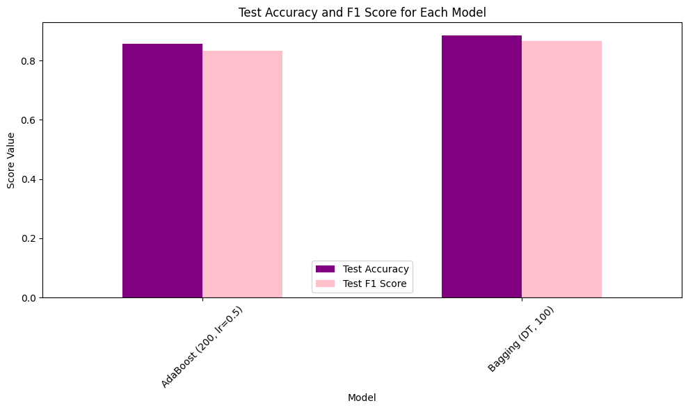
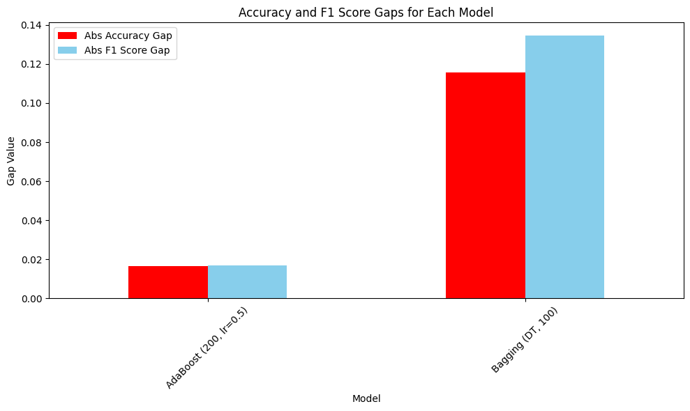

# Ensemble Machine Learning
**Author:** Dan Miller
**Date:** November 18th, 2025
**Objective:** Successfully create an ensemble model to accurately predict the quality of red wine.

## Introduction

This project explores the Wine Quality UCI dataset, specifically the set on red wine. With the goal of being able to create an ensemble model to predict wine quality. The data will first be explored and prepped, then two models will be created. The performance of the two models will be compared and a conclusion will be given at the end.

## Imports

```python
import matplotlib.pyplot as plt
import pandas as pd
from sklearn.ensemble import (
    AdaBoostClassifier,
    BaggingClassifier,
)
from sklearn.metrics import (
    accuracy_score,
    confusion_matrix,
    f1_score,
)
from sklearn.model_selection import train_test_split
from sklearn.tree import DecisionTreeClassifier
```

## Section 1. Load and Inspect the Data

```python
# Load the dataset

df = pd.read_csv("winequality-red.csv",sep=";")

# Display structure and first few rows
df.info()
df.head()
```

    <class 'pandas.core.frame.DataFrame'>
    RangeIndex: 1599 entries, 0 to 1598
    Data columns (total 12 columns):
     #   Column                Non-Null Count  Dtype  
    ---  ------                --------------  -----  
     0   fixed acidity         1599 non-null   float64
     1   volatile acidity      1599 non-null   float64
     2   citric acid           1599 non-null   float64
     3   residual sugar        1599 non-null   float64
     4   chlorides             1599 non-null   float64
     5   free sulfur dioxide   1599 non-null   float64
     6   total sulfur dioxide  1599 non-null   float64
     7   density               1599 non-null   float64
     8   pH                    1599 non-null   float64
     9   sulphates             1599 non-null   float64
     10  alcohol               1599 non-null   float64
     11  quality               1599 non-null   int64  
    dtypes: float64(11), int64(1)
    memory usage: 150.0 KB

<div>
<style scoped>
    .dataframe tbody tr th:only-of-type {
        vertical-align: middle;
    }

    .dataframe tbody tr th {
        vertical-align: top;
    }

    .dataframe thead th {
        text-align: right;
    }
</style>
<table border="1" class="dataframe">
  <thead>
    <tr style="text-align: right;">
      <th></th>
      <th>fixed acidity</th>
      <th>volatile acidity</th>
      <th>citric acid</th>
      <th>residual sugar</th>
      <th>chlorides</th>
      <th>free sulfur dioxide</th>
      <th>total sulfur dioxide</th>
      <th>density</th>
      <th>pH</th>
      <th>sulphates</th>
      <th>alcohol</th>
      <th>quality</th>
    </tr>
  </thead>
  <tbody>
    <tr>
      <th>0</th>
      <td>7.4</td>
      <td>0.70</td>
      <td>0.00</td>
      <td>1.9</td>
      <td>0.076</td>
      <td>11.0</td>
      <td>34.0</td>
      <td>0.9978</td>
      <td>3.51</td>
      <td>0.56</td>
      <td>9.4</td>
      <td>5</td>
    </tr>
    <tr>
      <th>1</th>
      <td>7.8</td>
      <td>0.88</td>
      <td>0.00</td>
      <td>2.6</td>
      <td>0.098</td>
      <td>25.0</td>
      <td>67.0</td>
      <td>0.9968</td>
      <td>3.20</td>
      <td>0.68</td>
      <td>9.8</td>
      <td>5</td>
    </tr>
    <tr>
      <th>2</th>
      <td>7.8</td>
      <td>0.76</td>
      <td>0.04</td>
      <td>2.3</td>
      <td>0.092</td>
      <td>15.0</td>
      <td>54.0</td>
      <td>0.9970</td>
      <td>3.26</td>
      <td>0.65</td>
      <td>9.8</td>
      <td>5</td>
    </tr>
    <tr>
      <th>3</th>
      <td>11.2</td>
      <td>0.28</td>
      <td>0.56</td>
      <td>1.9</td>
      <td>0.075</td>
      <td>17.0</td>
      <td>60.0</td>
      <td>0.9980</td>
      <td>3.16</td>
      <td>0.58</td>
      <td>9.8</td>
      <td>6</td>
    </tr>
    <tr>
      <th>4</th>
      <td>7.4</td>
      <td>0.70</td>
      <td>0.00</td>
      <td>1.9</td>
      <td>0.076</td>
      <td>11.0</td>
      <td>34.0</td>
      <td>0.9978</td>
      <td>3.51</td>
      <td>0.56</td>
      <td>9.4</td>
      <td>5</td>
    </tr>
  </tbody>
</table>
</div>


There are 1599 samples available with 12 columns made up of 11 features and the one target.

The target is quality, an integer score from 0-10, with 0 being the worst and 10 the best.

## Section 2. Prepare the Data

We are going to be simplify the target into three categories: low, medium, and high

Then we'll convert those three categories into numeric for modeling ease: low = 0, medium = 1, high = 2

```python
# Helper function to create the quality_label column

def quality_to_label(q):
    """Convert a numeric quality score to a categorical label."""
    if q <= 4:
        return "low"
    elif q <= 6:  # noqa: RET505
        return "medium"
    else:
        return "high"

# Helper function to create numeric column
def quality_to_numeric(q):
    """Convert a numeric quality score to a numeric label."""
    if q <= 4:
        return 0
    elif q <= 6:  # noqa: RET505
        return 1
    else:
        return 2

# Call the apply() method to create the new column

df["quality_label"] = df["quality"].apply(quality_to_label)

df["quality_numeric"] = df["quality"].apply(quality_to_numeric)
```

## Section 3. Feature Selection and Justification


As mentioned, the target will be quality, but we will be using the quality_numeric column for modeling ease.

The input features will be the rest of the dataset besides quality and quality_label.

Input features:

- fixed acidity
- volatile acidity
- citric acid
- residual sugar
- chlorides
- free sulfur dioxide
- total sulfur dioxide
- density
- pH
- sulphates
- alcohol

Target:

- quality_numeric

```python
# Create the X and y variables for modeling
X = df.drop(columns=["quality", "quality_label", "quality_numeric"])
y = df["quality_numeric"]
```

## Section 4. Split the Data into Train and Test

```python
# Create the training and testing sets
X_train, X_test, y_train, y_test = train_test_split(
    X, y, test_size=0.2, random_state=42, stratify=y
)
```

## Section 5. Evaluate Model Performance

```python
# Create a helper function to train and evaluate models

def evaluate_model(name, model, X_train, y_train, X_test, y_test, results):  # noqa: N803
    """Train and evaluate a model, storing results in a dictionary."""
    model.fit(X_train, y_train)

    y_train_pred = model.predict(X_train)
    y_test_pred = model.predict(X_test)

    train_acc = accuracy_score(y_train, y_train_pred)
    test_acc = accuracy_score(y_test, y_test_pred)
    train_f1 = f1_score(y_train, y_train_pred, average="weighted")
    test_f1 = f1_score(y_test, y_test_pred, average="weighted")

    print(f"\n{name} Results")
    print("Confusion Matrix (Test):")
    print(confusion_matrix(y_test, y_test_pred))
    print(f"Train Accuracy: {train_acc:.4f}, Test Accuracy: {test_acc:.4f}")
    print(f"Train F1 Score: {train_f1:.4f}, Test F1 Score: {test_f1:.4f}")

    results.append(
        {
            "Model": name,
            "Train Accuracy": train_acc,
            "Test Accuracy": test_acc,
            "Accuracy Gap": train_acc - test_acc,
            "Train F1 Score": train_f1,
            "Test F1 Score": test_f1,
            "F1 Score Gap": train_f1 - test_f1
        }
    )
```

### Model 1: AdaBoost (200, lr=0.5)

```python
# Create empty dictionary

results = []

# Call evaluate_model for AdaBoost

evaluate_model(
    "AdaBoost (200, lr=0.5)",
    AdaBoostClassifier(n_estimators=200, learning_rate=0.5, random_state=42),
    X_train,
    y_train,
    X_test,
    y_test,
    results
)
```

    AdaBoost (200, lr=0.5) Results
    Confusion Matrix (Test):
    [[  1  12   0]
     [  2 255   7]
     [  0  25  18]]
    Train Accuracy: 0.8397, Test Accuracy: 0.8562
    Train F1 Score: 0.8160, Test F1 Score: 0.8330

### Model 2: Bagging

```python
# Call evaluate_model for Bagging

evaluate_model(
    "Bagging (DT, 100)",
    BaggingClassifier(estimator=DecisionTreeClassifier(), n_estimators=100, random_state=42),
    X_train,
    y_train,
    X_test,
    y_test,
    results
)
```

    Bagging (DT, 100) Results
    Confusion Matrix (Test):
    [[  0  13   0]
     [  0 252  12]
     [  0  12  31]]
    Train Accuracy: 1.0000, Test Accuracy: 0.8844
    Train F1 Score: 1.0000, Test F1 Score: 0.8655

## Section 6. Compare Results

```python
# Create a table of results
results_df = pd.DataFrame(results)

# Print the summary
print("\nSummary of All Models:")
display(results_df)

# Get the data ready for plotting

rdf = pd.DataFrame(results)

rdf["Abs Accuracy Gap"] = rdf["Accuracy Gap"].abs()
rdf["Abs F1 Score Gap"] = rdf["F1 Score Gap"].abs()

# Plot the accuracy and F1 scores for each model
rdf.plot(
    x="Model",
    y=["Test Accuracy", "Test F1 Score"],
    kind="bar",
    color=["purple", "pink"],
    figsize=(10, 6),
)

plt.xlabel("Model")
plt.ylabel("Score Value")
plt.title("Test Accuracy and F1 Score for Each Model")
plt.xticks(rotation=45)
plt.tight_layout()
plt.show()

# Plot the gap results for each model

rdf.plot(
    x="Model",
    y=["Abs Accuracy Gap", "Abs F1 Score Gap"],
    kind="bar",
    color=["red", "skyblue"],
    figsize=(10, 6),
)

plt.xlabel("Model")
plt.ylabel("Gap Value")
plt.title("Accuracy and F1 Score Gaps for Each Model")
plt.xticks(rotation=45)
plt.tight_layout()
plt.show()
```

Summary of All Models:

<div>
<style scoped>
    .dataframe tbody tr th:only-of-type {
        vertical-align: middle;
    }

    .dataframe tbody tr th {
        vertical-align: top;
    }

    .dataframe thead th {
        text-align: right;
    }
</style>
<table border="1" class="dataframe">
  <thead>
    <tr style="text-align: right;">
      <th></th>
      <th>Model</th>
      <th>Train Accuracy</th>
      <th>Test Accuracy</th>
      <th>Accuracy Gap</th>
      <th>Train F1 Score</th>
      <th>Test F1 Score</th>
      <th>F1 Score Gap</th>
    </tr>
  </thead>
  <tbody>
    <tr>
      <th>0</th>
      <td>AdaBoost (200, lr=0.5)</td>
      <td>0.839719</td>
      <td>0.856250</td>
      <td>-0.016531</td>
      <td>0.815964</td>
      <td>0.832962</td>
      <td>-0.016998</td>
    </tr>
    <tr>
      <th>1</th>
      <td>Bagging (DT, 100)</td>
      <td>1.000000</td>
      <td>0.884375</td>
      <td>0.115625</td>
      <td>1.000000</td>
      <td>0.865452</td>
      <td>0.134548</td>
    </tr>
  </tbody>
</table>
</div>



